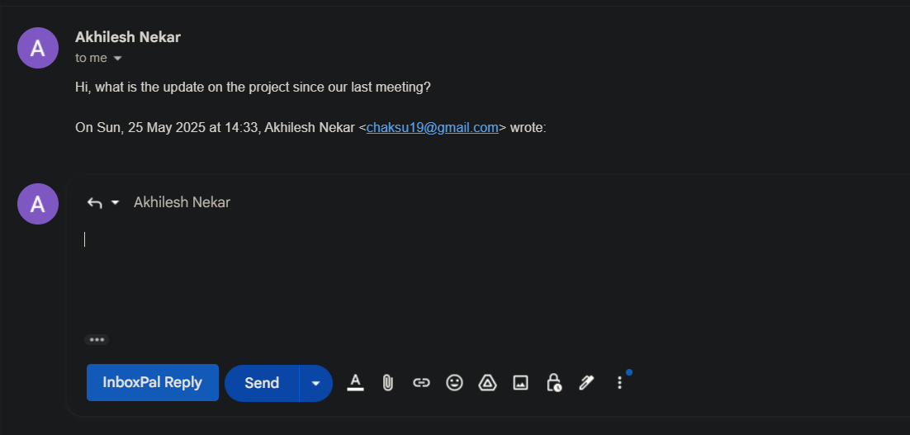

# 📬 InboxPal – AI Email Reply Assistant (Chrome Extension + Web App)

**InboxPal** is a productivity-boosting AI tool that helps you generate professional and context-aware email replies based on the tone you choose — right inside your Gmail compose window. Whether you're replying formally or sending a friendly note, InboxPal has you covered with one click.

## 🚀 Features

* ✉️ One-click AI-generated replies in Gmail
* 🤖 Powered by GPT for smart and context-aware responses
* 🎯 Tone selection: Formal, Friendly, Assertive, Apologetic, Thankful
* 🧩 Seamless Chrome Extension Integration
* 🌐 Optional Web App to manually generate replies
* ⚙️ Backend built with Spring Boot for enterprise-grade performance

## 🧩 Chrome Extension Preview

🧠 Automatically detects your reply intent and injects the generated response directly into the Gmail compose box!

## 🌐 Web App Preview

Built using **React** and **Material UI** with a beautiful, responsive design.

🔗 **Try the frontend**: [InboxPal Web App](https://inbox-pal.vercel.app/)  
📽️ **Watch the Chrome extension Demo Video**: [InboxPal Demo on YouTube](https://youtube.com/your-demo-video)

## 🛠️ Tech Stack

| Frontend | Backend | AI Engine | Browser Integration |
|----------|---------|-----------|-------------------|
| React + MUI | Spring Boot | Gemini API | Chrome Extension API |


## 🧪 How to Run Locally

### 🔌 Backend (Spring Boot)

```bash
cd email-assistant
./mvnw spring-boot:run
```

Make sure you configure your `application.properties`:

```properties
GEMINI_API_KEY=your_api_key
GEMINI_API_URL=your_api_url
```

### 💻 Frontend (React)

```bash
cd frontend
npm install
npm start
```

### 🧩 Chrome Extension

1. Go to `chrome://extensions`
2. Enable **Developer Mode**
3. Click **Load Unpacked**
4. Select the `InboxPal-extension` folder
